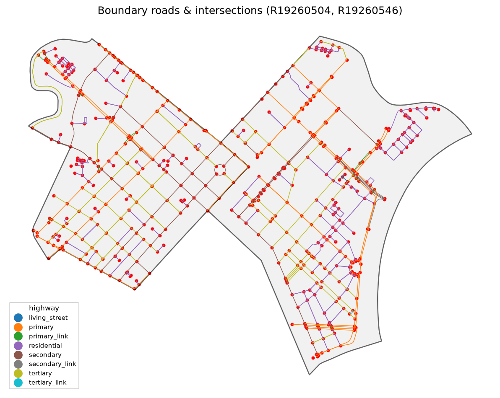

# osmnx-tools

Extract and display the road network and intersection data inside OpenStreetMap **boundary relations** using [OSMnx](https://github.com/gboeing/osmnx) and [uv](https://docs.astral.sh/uv/).


*Demo data extracted from OpenStreetMap (Phường Sài Gòn and Phường Xuân Hòa)*

## Features

- **`osm-extract`** - Given one or more OSM relation IDs of type `boundary`, downloads the road network and intersection data contained within each boundary and saves it to disk (GeoJSON + JSON summary).
- **`osm-display`** - Loads the saved data and presents it: printed summary statistics (including POIs) plus a static map (roads colored by highway class, intersections as red dots, POIs as blue stars) saved to PNG.
- **`osm-pois`** - Given one or more OSM element IDs (node/way/relation), extracts the corresponding points of interest (POIs) and adds them to an existing data folder, merging with any POIs already there.

## Requirements

- Python >= 3.10
- [uv](https://docs.astral.sh/uv/) (project & virtual environment management)

## Install

```bash
uv sync
```

This installs `osmnx`, `matplotlib`, and `pandas` into the project's virtual environment.

## Usage

### Extract Boundaries

```bash
# Extract roads & intersections for one or more boundary relations
uv run osm-extract 51800 51781 --out data

# Options:
#   --out DIR              Output directory (default: ./data)
#   --network-type TYPE    drive | drive_service | all | bike | walk | rail (default: drive)
```

Relation IDs may be passed with or without the `R` prefix (e.g. `12345` or `R12345`). Multiple IDs are merged into one dataset, with each row tagged by `relation_id`.

**Outputs** (written to `--out`):

| File                   | Description                                    |
|------------------------|------------------------------------------------|
| `boundary.geojson`     | Unioned boundary polygon(s)                    |
| `roads.geojson`        | All road edges (with `relation_id`)            |
| `intersections.geojson`| All intersection nodes (with `relation_id`)    |
| `pois.geojson`         | Extracted points of interest (from `osm-pois`)|
| `summary.json`         | Metadata: relations, counts, road length, POIs, errors, timestamp |

### Extract POIs

```bash
# Extract one or more POIs and add them to an existing data folder
uv run osm-pois W5013364 N240109189 --out data

# Options:
#   --out DIR       Data directory to add POIs to (default: ./data)
#   --replace       Replace pois.geojson instead of merging with existing POIs
```

POI IDs may be passed with or without the `N`/`W`/`R` type prefix (e.g. `5013364` or `W5013364`). When no prefix is given, the ID defaults to node (`N`). New POIs are merged into any existing `pois.geojson` in the output directory and deduplicated by `osm_id` + `osm_type`. The `summary.json` file is updated with `total_pois`, `pois`, and `poi_errors` keys.

> **Tip:** You can find an element's OSM ID from its page on [openstreetmap.org](https://www.openstreetmap.org) (the URL contains the type and ID, e.g. `node/240109189`, which maps to `N240109189`).

### Display

```bash
# Print summary stats and write a map PNG
uv run osm-display data --map data/map.png

# Options:
#   --map PATH     Path to save the PNG map (default: <out>/map.png)
#   --no-plot      Skip drawing the map
#   --no-pois      Do not load, print, or plot points of interest
#   --show         Show the plot interactively (requires a display)
```

The console summary includes:
- Total roads, intersections, road length (km), and POIs
- Per-relation counts
- POI list (name + OSM ID)
- Road count by `highway` class
- Top 10 longest roads
- Intersection degree distribution (`street_count`)

### Typical Workflow

```bash
# 1. Install dependencies
uv sync

# 2. Extract roads & intersections for a boundary relation
uv run osm-extract 51800 --out data

# 3. Add POIs to the same data folder
uv run osm-pois W5013364 N240109189 --out data

# 4. Display the results (stats + map PNG)
uv run osm-display data --map data/map.png
```

## Project Layout

```
osmnx/
  pyproject.toml              # uv-managed project, deps + console scripts
  src/osmnx_tools/
    __init__.py
    extract.py                # osm-extract entry point
    display.py                # osm-display entry point
    pois.py                   # osm-pois entry point
```

## How It Works

### Boundary extraction (`osm-extract`)

1. Resolves each relation ID to a boundary polygon via `ox.geocode_to_gdf` (`by_osmid=True`).
2. Builds the street network inside the polygon via `ox.graph_from_polygon` with `simplify=True` and `retain_all=True`.
3. Converts the graph to GeoDataFrames with `ox.graph_to_gdfs` - edges become **roads**, nodes become **intersections**.
4. Tags every row with `relation_id` and merges multiple relations into one dataset.

### POI extraction (`osm-pois`)

1. Normalizes each ID with its OSM type prefix (`N`/`W`/`R`; defaults to `N`).
2. Resolves each POI via the Nominatim lookup endpoint (`ox.geocode_to_gdf` with `by_osmid=True`).
3. Tags each POI with `osm_id` and `osm_type`, then merges into any existing `pois.geojson`.
4. Deduplicates by `osm_id` + `osm_type` and updates `summary.json`.

### POI display (`osm-display`)

1. Loads `pois.geojson` from the data directory (if it exists).
2. Prints a POI list (OSM type, ID, and name) in the console summary.
3. Plots POIs as blue star markers on the map. Polygon POI geometries are converted to their centroid for point display.
4. Pass `--no-pois` to skip POI loading, printing, and plotting entirely.

## Robustness

- Invalid or unroutable relation IDs are reported under `errors` in `summary.json` and skipped; remaining IDs continue processing.
- POI IDs that fail to resolve are reported under `poi_errors` in `summary.json` and skipped; remaining POIs continue processing.
- OSMnx HTTP caching is enabled to be a polite API client and speed up re-runs.
- Headless hosts are supported (matplotlib uses the Agg backend).

## License

This project uses OpenStreetMap data. OSM data is (c) OpenStreetMap contributors, licensed under the [Open Database License (ODbL)](https://www.openstreetmap.org/copyright).
